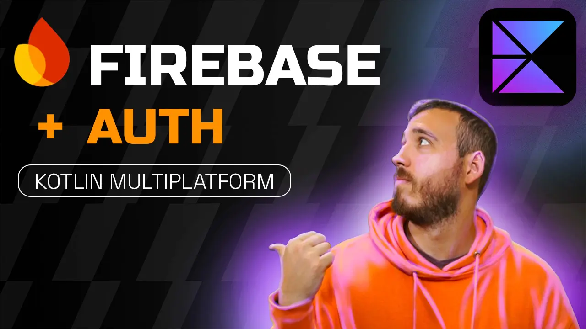

# FIREBASE en Kotlin MULTIPLATFORM - Curso KMP y Firebase desde CERO.

<a href="https://youtu.be/IKG1eV2SetA">
</a>

 
    
    
    
    
    
    
    

## Aprende a PROGRAMAR aplicaciones MULTIPLATAFORMA para ANDROID y iOS con KMP

## 👨‍💻 Autor

Desarrollado por **[AristiDevs](https://aristi.dev)**.

- [YouTube](https://www.youtube.com/@ArisGuimera)
- [Twitter](https://twitter.com/ArisGuimera)
- [LinkedIn](https://www.linkedin.com/in/arisguimera/)

----------

## 🚀 AppCademy.dev

<a href="https://appcademy.dev">
</a>

Este curso está patrocinado por [AppCademy.dev](https://appcademy.dev) mi plataforma de cursos premium donde no solo aprendemos tecnologías sino que profundizamos en sus desarrollos a través de buenas prácticas y contenido avanzado.

----------

## 📦 Otros Proyectos

Si te gustó este proyecto, no olvides echar un vistazo a otros repositorios:

<table>
<tr>
<td width="50%">
<h3 align="center">Curso Android Básico</h3>

Aprende a programar aplicaciones <strong>Android con Kotlin desde cero</strong> - En este curso aprenderás todo lo necesario ya que no es necesario ningún conocimiento previo. Curso <strong>GRATUITO de 12 horas</strong> con todo el código disponible para descargar.

</td>

<td width="50%">
                
<h3 align="center">Arquitectura MVVM</h3>

 

Las arquitecturas son <strong>IMPRESCINDIBLES</strong> para poder trabajar como desarrollador/a Android. En este curso, divido por ramas irás aprendiendo a implementar una arquitectura real y robusta con inyección de dependencias, clean architecture, testing y mucho más.

</table>

 

<table>
<tr>
<td width="50%">
<h3 align="center">Curso Android Intermedio</h3>

Aprende a programar aplicaciones <strong>Android con Kotlin nivel intermedio</strong> - En este curso nos centraremos en las <strong>buenas prácticas, arquitectura y testing</strong>. Curso <strong>GRATUITO de 8 horas</strong> con todo el código disponible para descargar.

</td>

<td width="50%">
<h3 align="center">Curso Kotlin Multiplatform</h3>

Aprende a programar aplicaciones <strong>multiplataform con Kotlin y Jetpack Compose</strong> - En este curso nos centraremos en dominar Kotlin Multiplatform <strong>desde cero</strong>. Curso <strong>GRATUITO</strong> (en desarrollo) con todo el código disponible para descargar.

</td>  
</table>

 
